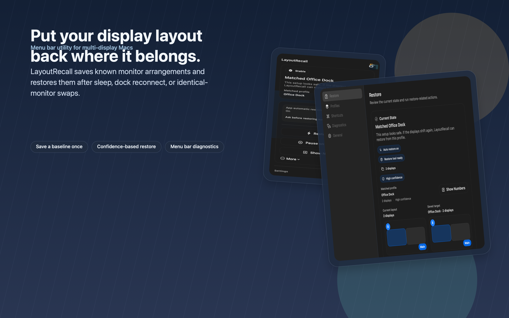
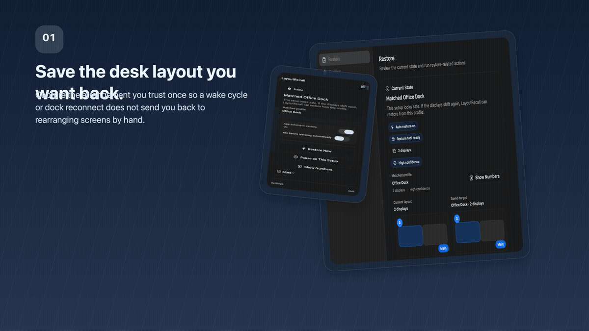
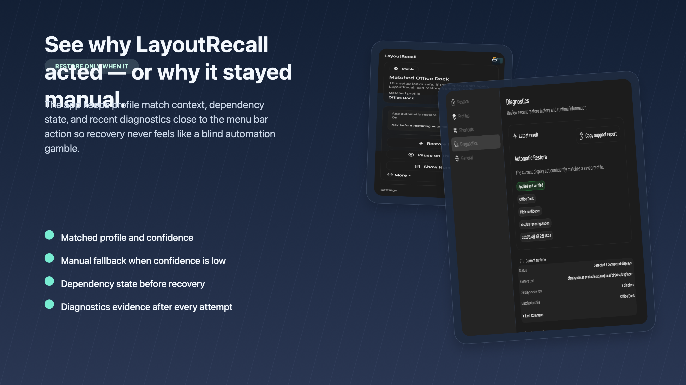
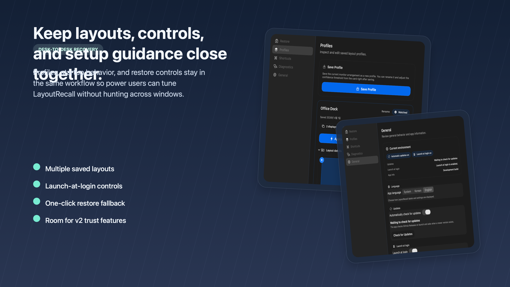

# LayoutRecall

> Restore the monitor layout macOS keeps scrambling.
>
> LayoutRecall is the open-source macOS menu bar app for MacBook + dock + 2+ display desks. Save a known-good layout once, then bring it back after sleep, wake, or reconnect — automatically when the match is confident, manually when it is not.



## Install now

- **Download the signed app:** [GitHub Releases](https://github.com/aroido/layoutrecall/releases)
- **Install with Homebrew:** `brew install --cask aroido/layoutrecall/layoutrecall`
- **See the short product story:** [demo GIF](docs/marketing/generated/final/layoutrecall-demo.gif) · [demo MP4](docs/marketing/generated/final/layoutrecall-demo.mp4)

Quick reasons people install it:

- **Save a desk once:** keep a known-good layout ready for the next reconnect.
- **Restore only when safe:** automatic recovery is limited to strong profile matches.
- **Stay in control when it is not safe:** `Restore Now`, `Apply Layout`, `Show Numbers`, and diagnostics stay available.

## Built for the desk setup that keeps drifting

LayoutRecall is aimed first at people who already know the exact monitor layout they want back:

- MacBook + dock + 2+ external display users
- developers, creators, analysts, and operators with left/right monitor muscle memory
- anyone tired of identical displays returning in the wrong order after sleep, wake, or reconnect

If you want a full display-management suite or magical support for every complex four-plus-display rearrangement, this repo is intentionally narrower than that.

## Why people trust LayoutRecall

- **It is conservative by design.** Automatic restore only runs when the connected display set strongly matches a saved profile.
- **It stays transparent when it refuses to act.** If the match is weak or a dependency is missing, the app keeps recovery manual and shows why.
- **It gives you direct recovery controls.** `Restore Now`, `Apply Layout`, `Show Numbers`, and `Swap Positions` are available when you want control.
- **It exposes real diagnostics.** Confidence, dependency state, and recent restore evidence stay visible instead of being buried.
- **It is easy to evaluate honestly.** Signed downloads, a Homebrew cask, and the open-source codebase make the install path lower-friction than a random display script.

## What happens when macOS scrambles your desk

| When macOS forgets your setup | What LayoutRecall does |
| --- | --- |
| Identical monitors come back in the wrong order after sleep or wake | Restores a saved profile when the live display snapshot is a confident match |
| Dock reconnect changes the main display or origin unexpectedly | Brings back the known-good arrangement you already saved |
| Auto-restore would be risky | Stops short, shows diagnostics, and leaves recovery manual on purpose |
| You want to recover immediately yourself | Gives you `Restore Now`, `Apply Layout`, `Show Numbers`, and `Swap Positions` |

## Short demo



The demo follows the real product story: a desk layout drifts, a saved profile is recognized, restore stays confidence-aware, and diagnostics/manual fallback remain visible.

## Proof that the app is real, safe, and controllable

### Trust before restore



LayoutRecall keeps the matched profile, dependency status, confidence signals, and recent restore evidence close to the action so users can tell what happened — or why the app refused to guess.

### Profiles and recovery controls



Save more than one desk profile, tune how restore behaves on startup, and keep manual recovery actions within reach when you want a predictable fallback.

## Features

- Saves and manages one or more display layout profiles from the current live monitor arrangement
- Watches for real display reconfiguration events and attempts automatic restore when confidence is high
- Falls back to manual recovery with `Restore Now`, direct `Apply Layout`, `Show Numbers`, and `Swap Positions`
- Shows profile, confidence, dependency, and diagnostic context directly from the menu bar
- Persists diagnostics history and keeps recovery controls inside three primary settings sections: Restore, Profiles, and App
- Supports launch at login, keyboard shortcuts, in-app update checks, and explicit `System` / `English` / `Korean` language choice
- Can install `displayplacer` through the app flow when the dependency is missing

## Install details

### Download the signed app

1. Download the latest `DMG` from [GitHub Releases](https://github.com/aroido/layoutrecall/releases)
2. Drag `LayoutRecall.app` into `/Applications`
3. Launch the app and save a baseline layout from the menu bar

### Install with Homebrew

```bash
brew install --cask aroido/layoutrecall/layoutrecall
```

If `displayplacer` is missing, LayoutRecall can guide installation from the app flow. You can evaluate the UI and save a baseline profile first, then enable actual restore commands once the dependency is available.

## Requirements

- macOS 14 or later
- Apple Silicon is currently the primary tested target
- `displayplacer` is required for actual restore commands

LayoutRecall can build and run tests without `displayplacer`, but restoring a saved layout depends on it being available on `PATH`.

## FAQ

### Does it work without `displayplacer`?

The app runs without it, but actual layout restore requires `displayplacer` to be available. LayoutRecall surfaces missing dependency state and can guide the install flow.

### Will it move my monitors automatically every time?

No. It only auto-restores when the saved profile match is strong enough. Lower-confidence cases stay manual on purpose.

### Is it meant for very complex 4+ monitor setups?

Not as a fully automatic promise yet. More complex layouts remain manual/review-heavy until the app can expose a predictable repositioning model.

## Development

```bash
git clone https://github.com/aroido/layoutrecall.git
cd layoutrecall
make build
make test
```

Useful commands:

```bash
make run
./scripts/run-ai-verify --mode full
```

The repository uses a scratch build path in `~/Library/Caches` to avoid Swift index-store rename failures on slower or externally mounted volumes.

Open `Package.swift` in Xcode if you want an IDE workflow.

## Repository layout

- `Sources/LayoutRecallApp`: SwiftUI menu bar application shell
- `Sources/LayoutRecallKit`: matching, persistence, restore execution, localization, and diagnostics logic
- `Tests/LayoutRecallAppTests`: app-level state, UI harness, and end-to-end coverage
- `Tests/LayoutRecallKitTests`: matcher, localization, restore, and persistence coverage
- `docs/PRD.md`: product summary
- `docs/SPEC.md`: detailed current behavior, architecture, and 2.0 priorities

## Release workflow

Tagged releases are published through GitHub Actions.

Relevant pieces:

- `./scripts/release-preflight.sh <tag>` validates version and required secrets
- `./scripts/build-release-archive` builds signed and notarized `ZIP` and `DMG` artifacts
- `.github/workflows/release.yml` publishes release assets and syncs the Homebrew tap

Example local release build:

```bash
VERSION=<version> BUILD_NUMBER=$(date +%Y%m%d%H%M%S) ./scripts/build-release-archive
```

The app checks GitHub Releases for `aroido/layoutrecall`. Automatic update checks can be controlled from `App > Updates`.

## Contributing

Issues and pull requests are welcome. If you are changing restore behavior, matching logic, localization, release packaging, or repo-visible marketing surfaces, run:

```bash
./scripts/run-ai-verify --mode full
```

## License

MIT. See [LICENSE](LICENSE).
